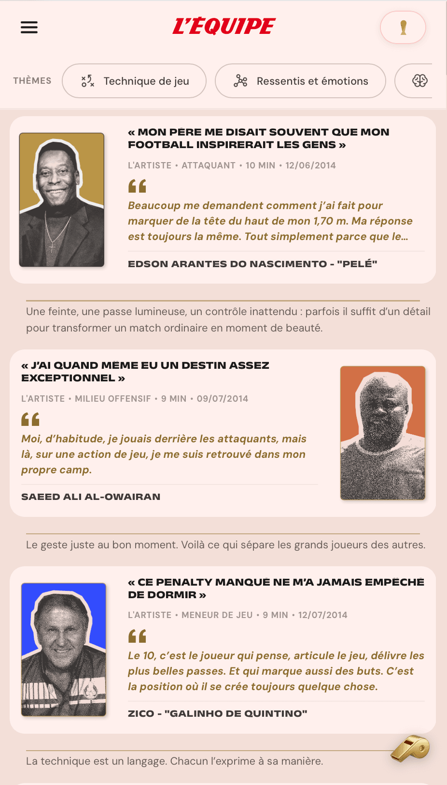

# L'Équipe — Interactive Sports Archive

*"Rediscover the legends of the World Cup through their exclusive interviews and collect their digital cards."*

An interactive web application designed to digitize and gamify **30+ historical sports interviews** from *L'Équipe's* physical archives. **Developed from scratch in an intense 5-day hackathon sprint**, the project combines interactive storytelling, gamification (card collection, trophies), and algorithmic personalization to make over 300 pages of dense textual archives highly accessible to a younger audience (<35 y/o).

<!-- markdownlint-disable MD033 -->
<p align="center">
  
</p>
<!-- markdownlint-enable MD033 -->


## Core Features

- **Fan Archetypes:** Users start by selecting a psychological profile (The Strategist, The Artist, etc.) which alters the article recommendation engine.
- **Card Collection:** Reading an interview to completion dynamically unlocks a beautifully designed, high-resolution digital player card.
- **Trophy Progression:** Gamified tiers (Bronze, Silver, Gold) reward consistent reading engagement.
- **Immersive UX:** Integrated dark mode, "time remaining" sports clocks, and custom sound design (referee whistles) to create a premium experience.

## Architecture & System Design

The application was designed with a strict **Backend-less Architecture** using Next.js 14 Static Site Generation (SSG). This approach was chosen to ensure zero infrastructure costs, eliminate database latency, and maximize edge caching efficiency for static assets.

### Key Technical Contributions

As the Lead Tech / Software Architect for a cross-functional team of 8 (5 developers, 3 UI/UX designers), my focus was on system architecture, data flow, and state management:

**1. O(1) Algorithmic Recommendation Engine**
- **Problem:** Personalizing the content feed for users without a machine learning backend or server-side compute.
- **Solution:** Implemented a weighted matrix algorithm (`src/lib/data/categories.js`). By assigning a mathematical priority to 11 thematic categories across 6 "Fan Archetypes", the system achieves $O(1)$ lookup times and $O(N \log N)$ sorting for article recommendations entirely on the client side.

**2. LLM-Powered Data ETL Pipeline & Code-Splitting**
- **Problem:** The raw newspaper archives resulted in a massive 500KB+ JSON database that caused RAM saturation on older mobile devices.
- **Solution:** Engineered an LLM prompt pipeline to extract and normalize raw text, then applied strict **Data Code-Splitting**. The database was fractured into domain-specific chunks, allowing Next.js to fetch heavy text payloads only on dynamic routes (`generateStaticParams`).

**3. Client-Side Gamification Engine (Hydration Safe)**
- **Problem:** Implementing a user progression system without a backend, while avoiding Next.js Server-Side Rendering (SSR) mismatches.
- **Solution:** Developed a centralized React hook (`useCollection`) that acts as a local state engine synced with `localStorage`. It utilizes idempotent state updates and strict hydration flags (`loaded`) to safely sync browser storage without triggering React hydration errors.

**4. Team Governance & UI Performance**
- Enforced strict **Git Flow** (feature branching) and daily stand-ups to bridge the gap between Polytech engineers and EDNA designers over the 5-day sprint.
- Enforced strict CSS Modularity to prevent class collisions and maintain a minimal CSS footprint.
- Implemented hardware-accelerated micro-interactions and route transitions using Framer Motion.

## Data Model Example

To bypass a traditional database, the LLM-structured JSON acts as our definitive data source. Here is an excerpt of the parsed athlete schema:

```json
{
  "slug": "pele-1958",
  "nom": "Pelé",
  "pays": "Brésil",
  "mondial": "1958",
  "archetype": "L'artiste",
  "image": "/cartes_itw/Pelé.png",
  "theme_citations": {
    "technique_jeu": "« J'inscris le premier but de cette finale, un but d'anthologie... »"
  },
  "temps_lecture": "9 min"
}
```

## User Journey

```text
Home (animated intro)
    │
    ▼
Archetype Selection (6 fan profiles)
    │
    ▼
Interviews Feed ──────────► Complete Archive
(filtered by theme             (sorted by player,
 and archetype)                 country, WC edition)
    │
    ▼
Reading an interview
(unlocks the player's card)
    │
    ▼
Card Collection
(Bronze → Silver → Gold progression)
```

## Codebase Structure

```text
equipe/
│
├── app/                                # Pages (Next.js App Router)
├── components/                         # Modular React Components (UI & Logic)
├── hooks/                              # Custom React Hooks (useCollection state engine)
├── lib/                                # Algorithmic logic (Archetype Matrix) & Data Fetchers
├── data/                               # Static JSON database (Generated via LLM pipeline)
├── public/                             # Static Assets (Images, Audios)
├── next.config.js                      # Next.js Config (Static Export)
└── package.json                        # Dependencies and NPM scripts
```

## The Team ("La VAR")

This project was a highly collaborative effort bridging Software Engineering and Design.

### Engineering (Polytech Nantes)
- **Moutassim Djodallah:** Lead Tech & Software Architecture
- **Yassine El Maghraoui:** Data Engineer & JSON Pipelines
- **Amine Tighiouart:** Software Engineer (Next.js Routing)
- **Denis-Marius Vladu:** Core Logic (Gamification Hook)
- **Ayman Mellas:** Creative Developer (UI Integration)

### UI/UX Design (École de Design Nantes Atlantique)
- **Marie Baguelin:** Product Designer & UX Strategy
- **Juliette Matelot:** UX/UI Designer & Visual Identity
- **Olivier Ahehehinnou:** Motion Designer (SVG Animations)

## Tech Stack

- **Framework:** Next.js 14 (App Router, SSG)
- **UI:** React 18, Framer Motion
- **Styling:** CSS Modules
- **Package Manager:** pnpm

## Local Development

```bash
# Clone the repository
git clone https://github.com/mdjodallah/lequipe-interactive-archive.git
cd lequipe-interactive-archive

# Install dependencies
pnpm install

# Start the development server
pnpm dev
```

Open `http://localhost:3000` to view the application in the browser.

## Partners & License

**Partners:** Polytech Nantes, École de Design Nantes Atlantique (EDNA), Ouest Medialab, and L'Équipe.

- **Interviews & Editorial Content:** © L'Équipe. All rights reserved.
- **Codebase:** MIT License
